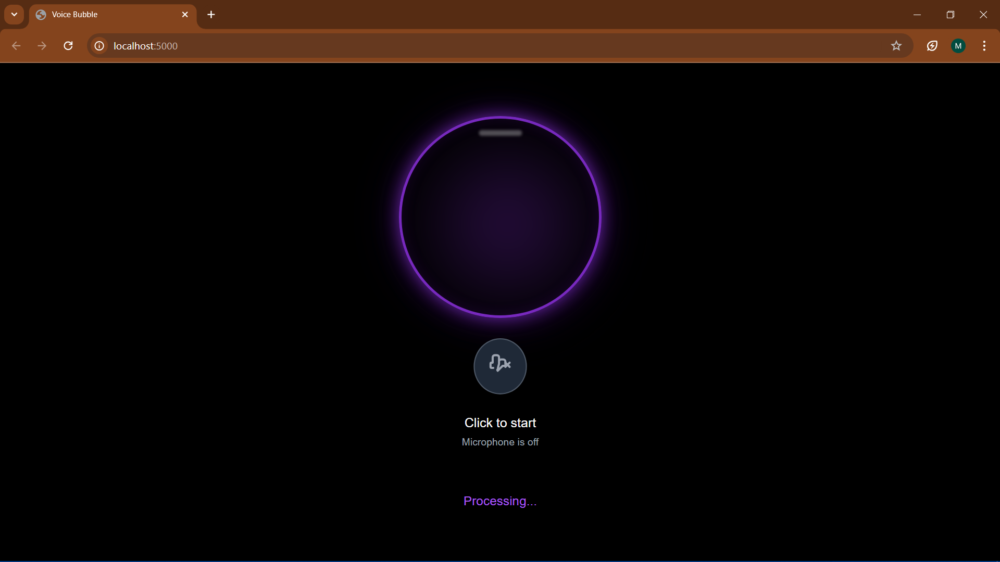

# 🧠 Voice Assistant using Python
A feature-rich, intelligent personal assistant built with Python that can perform voice-based tasks like sending emails, playing music, fetching weather, setting alarms, reading stories, and even operating via a web interface.

## ✨ Features
🎙️ Voice Command Recognition

📧 Email Sending & Summarization

📆 Google Calendar Integration

⏰ Reminders, Alarms, Timers

🌐 Google, Wikipedia, YouTube Search

🌦️ Weather Reports & Forecasts

📚 Moral Stories (via web scraping)

🎵 Play Music (YouTube/local)

📰 News Headlines from RSS feeds

📌 System Commands: Volume, Apps, Shutdown, Lock

📸 Screenshot & Text Extraction from Images

📍 Location, Distance & Nearby Place Detection

📜 Motivational Quotes, Jokes, Horoscopes, Dictionary

🌐 Web Mode with Flask frontend

## 🛠 Requirements
Install the dependencies with:
pip install -r requirements.txt

Make sure to also install:
Tesseract-OCR (for OCR support)
ChromeDriver (for Selenium, match your Chrome version)

## sample run image 

## 🚀 How to Run
🖥️ Desktop Mode (default):
python p1.py

🌐 Web Mode (Flask UI):
python p1.py web

## 🗣️ Sample Commands
Category	Example Command
WhatsApp	send whatsapp message Hello to Amma
Email	    send email to John with subject Meeting and body Let's catch up
Reminders	remind me to take medicine at 9:00 PM
Alarms	  set an alarm for 6:30 AM
Search	  search YouTube for lo-fi music
Weather  	what's the weather in Bangalore
Calendar	what's on my calendar today
Notes	    take a note buy milk
News	    news headlines
Stories	  tell me a story
Volume	  increase volume
System	  open application notepad
Location	what's my location
Dictionary define empathy
Timer	    set a timer for 2 minutes

## 🔐 Google Calendar Setup
Go to Google Cloud Console
Enable the Calendar API
Create OAuth credentials
Download credentials.json
First run will prompt Google login → creates token.json

## 🧠 Learning Capabilities
Remembers frequent commands in learning_data.json
Logs past requests in assistant_log.json
Keeps to-do, notes, and shopping lists persistently

## 📖 Story Source
Stories are fetched using web scraping from:
https://northccs.com/misc/short-story-examples-for-kids.html

## 🧩 Extensions
Already integrated with:

speech_recognition, pyttsx3, pywhatkit, wikipedia, imaplib, smtplib

Google Calendar API

Flask Web Mode

OCR via pytesseract

## 🛑 Disclaimer
This project is for educational use. Make sure you comply with terms of any APIs or websites you access via scraping or automation.

